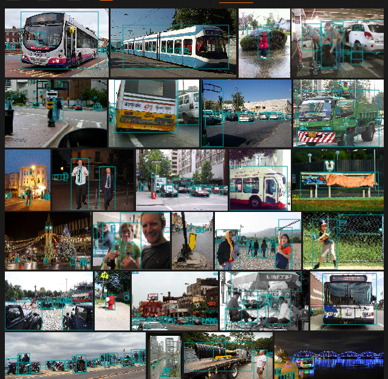
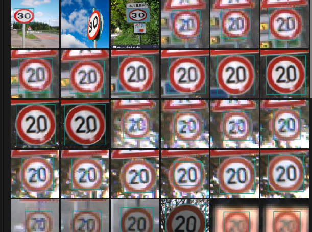
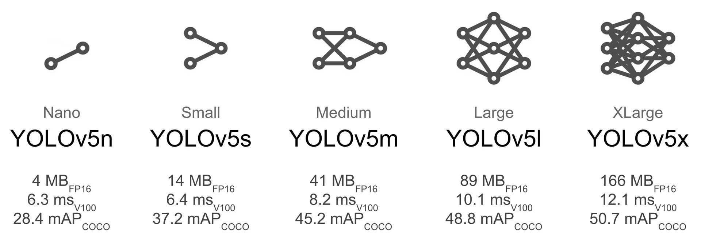
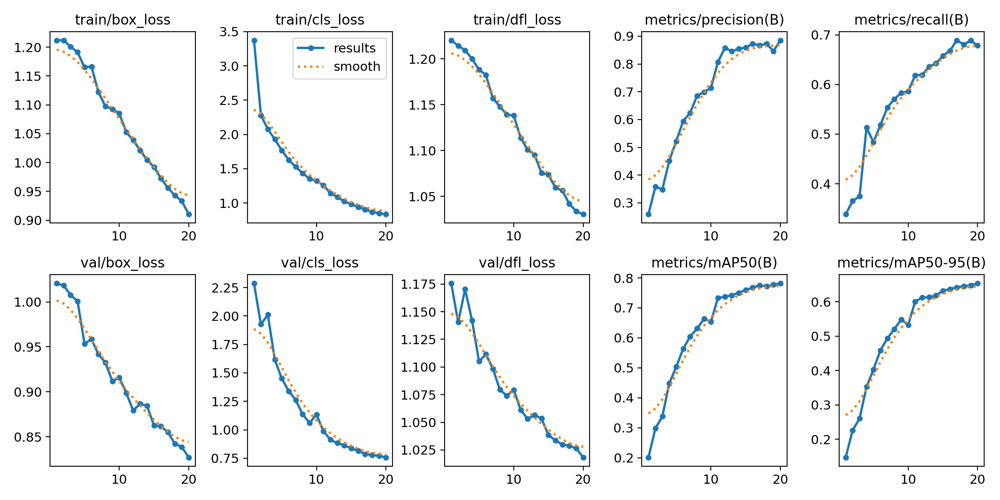

Note:
yolo11_large_cars_people_train_on_20_epochs <- inside is the main model

# STEPS TAKEN

## 1. Dataset Preparation 💾

To imitate real detection models used on cars <br>
for training we chose following classes to detect:

- 'person',
- 'car',
- 'Green Light',
- 'Red Light',
- 'Speed Limit 10',
- 'Speed Limit 100',
- 'Speed Limit 110',
- 'Speed Limit 120',
- 'Speed Limit 20',
- 'Speed Limit 30',
- 'Speed Limit 40',
- 'Speed Limit 50',
- 'Speed Limit 60',
- 'Speed Limit 70',
- 'Speed Limit 80',
- 'Speed Limit 90',
- 'Stop'

So in the end we would be able to detect **pedestrians, cars and traffic signs.**

In order to train model, we have to merge two datasets.

### Official [**COCO dataset**](https://docs.ultralytics.com/ru/datasets/detect/coco/) <br>

already has enough training samples for cars and people, <br> so we used it as base, <br> but we have to filter it out beforehand in order to remove unneccessary classes feeding.


Sample of pictures from COCO, already filtered classes: car, people.

#

#

#

### [TRAFFIC SIGN DETECTION dataset](https://www.kaggle.com/datasets/pkdarabi/cardetection)


Model with various samples of speed limit and stop signs.
<br>

For merging datasets we used [fiftyone](https://docs.voxel51.com/) library. <br>
It has exact functionality we need:

- Filter by classes and download COCO dataset
- Merge datasets
- Manage samples
- Export to Yolo dataset format

###

Merged dataset had around 4500 samples.

---

### Code: How to prepare dataset:

```python

import fiftyone.zoo as foz

dataset = foz.load_zoo_dataset(
    "coco-2017", # will download coco dataset if not already downloaded
    splits="train",
    download_if_necessary=True,
    classes=["person", "car"],
    max_samples=1000, #remove to extract all
    dataset_name="coco-cars-people"
)

#This creates folder in root dir under name fiftyone/ and downloads everything there

```

download coco dataset,<br>
filtered only by person and car for train

```python

cardetection_dir = "datasets\cardetection\car"

cardetection = fo.Dataset.from_dir(
    dataset_dir=cardetection_dir,
    dataset_type=fot.YOLOv5Dataset,
    split='train', #loads only from train folder
    label_field="ground_truth"
)

```

Then load samples from dataset of our traffic signs

<br>
<br>

Now that we have two train datasets we can merge

```python
combined_dataset = cardetection.clone() #clone dataset
combined_dataset.name = "merged-coco-yolo" #assign name

combined_dataset.add_samples(dataset)
# add samples from coco dataset to traffic signs dataset

```

<br>

Now we can export it to use later

```python

merged_coco_yolo = fo.load_dataset("merged-coco-yolo")

# Define where to save the data on disk
export_dir = "datasets/merged_coco_yolo"

# Define the specific classes you want to train on
# This ensures consistent ID mapping (0=person, 1=car)
target_classes = [
    'person',
    'car',
    'Green Light',
    'Red Light',
    'Speed Limit 10',
    'Speed Limit 100',
    'Speed Limit 110',
    'Speed Limit 120',
    'Speed Limit 20',
    'Speed Limit 30',
    'Speed Limit 40',
    'Speed Limit 50',
    'Speed Limit 60',
    'Speed Limit 70',
    'Speed Limit 80',
    'Speed Limit 90',
    'Stop'
]


# Export
print(f"Exporting data to {export_dir}...")
merged_coco_yolo.export(
    export_dir=export_dir,
    dataset_type=fo.types.YOLOv5Dataset, # Yolo format
    label_field="ground_truth",          # Ensure this matches your label field name
    split="train",                       # Puts all data into a 'train' folder
    classes=target_classes,              # Filters only these classes
)

```

Export format here is very important.

- Images go into an images/ folder.
- Labels (bounding boxes + class IDs) go into a labels/ folder.
- Class IDs correspond to the order in your classes list.

<br>
<br>

We want to split the dataset to train and val to train the model now (required by YOLO)

For that we have separate function

```python
import os
import shutil
import random
from pathlib import Path

# Define paths
base_dir = Path("datasets/merged_coco_yolo")
images_train = base_dir / "images" / "train"
labels_train = base_dir / "labels" / "train"
images_val = base_dir / "images" / "val"
labels_val = base_dir / "labels" / "val"

# Create val directories
images_val.mkdir(parents=True, exist_ok=True)
labels_val.mkdir(parents=True, exist_ok=True)

# Get list of images
image_files = list(images_train.glob("*.jpg")) + list(images_train.glob("*.png"))
num_val = int(len(image_files) * 0.2) # 20% for validation

# Shuffle and select
random.shuffle(image_files)
val_files = image_files[:num_val]

print(f"Moving {len(val_files)} images to validation...")

for img_path in val_files:
    # Move Image
    shutil.move(str(img_path), str(images_val / img_path.name))

    # Move matching Label
    label_name = img_path.stem + ".txt"
    label_src = labels_train / label_name
    if label_src.exists():
        shutil.move(str(label_src), str(labels_val / label_name))

print("Done.")

```

`Moving 906 images to validation...`<br>
`Done.`

Structure should be as follows:

```bash
PS C:\Users\<username>\datasets\merged_coco_yolo> tree
C:.
├───images
│   ├───train
│   └───val
└───labels
    ├───train
    └───val
```

Data preparation is done. ✅🥳

## 2. Model training 🤖

Yolo ultralytics repository has many-many models from which you can choose according to your needs.<br>

- YOLOv3
- YOLOv4
- YOLOv5
- YOLOv6
- YOLOv7
- YOLOv8
- YOLOv9
- YOLOv10
- YOLO11 **⬅️we're using!**
- YOLO12
- YOLO-World (Real-Time Open-Vocabulary Object Detection)
- YOLOE (Real-Time Seeing Anything)
  <br> and so on...
  <br>
  <br>

Each model also classifies by **size**.<br>



The bigger the size model ➡️ the more parameters ➡️ more features captured ➡️ <br>
SLOWER THE MODEL DETECTS AND MORE MEMORY IT USES

After many many training tries we chose **nano** version of YOLO11.

```python
# Optional
import torch
print(torch.cuda.is_available())
```

If you have nvidia videocard it's better to check if you can use it,<br> training will be faster that way
<br>
<br>
You might need to install cuda supported pytorch

```powershell
# CUDA 12.8
pip install torch==2.9.0 torchvision==0.24.0 torchaudio==2.9.0 --index-url https://download.pytorch.org/whl/cu128
```

<br>
<br>
<br>

Training code:

```python
model = YOLO("yolo11n.pt") #yolo will download it if not present in current folder

results = model.train(
    data="datasets/merged_coco_yolo/dataset.yaml",
    epochs=20,
    #Low epochs here is actually better to avoid model `forgetting`.
    imgsz=640,
    batch=16,
    project="yolo11_large_cars_people_train_on_20_epochs",
    name="run_1"
)
```

Yolo has a lot of functionality abstracted, so it will be very easy for novices.

Output will look something like this:

```output
      Epoch    GPU_mem   box_loss   cls_loss   dfl_loss  Instances       Size
      19/20      2.87G     0.9334     0.8514      1.034         14        640: 100% ━━━━━━━━━━━━ 227/227 14.5it/s 15.6s0.1s
                 Class     Images  Instances      Box(P          R      mAP50  mAP50-95): 100% ━━━━━━━━━━━━ 29/29 13.1it/s 2.2s0.1s
                   all        906       2441      0.846      0.689      0.777      0.648

      Epoch    GPU_mem   box_loss   cls_loss   dfl_loss  Instances       Size
      20/20      2.87G     0.9104     0.8353       1.03          8        640: 100% ━━━━━━━━━━━━ 227/227 14.6it/s 15.6s<0.1s
                 Class     Images  Instances      Box(P          R      mAP50  mAP50-95): 100% ━━━━━━━━━━━━ 29/29 13.6it/s 2.1s0.1s
                   all        906       2441      0.885      0.678      0.782      0.654

20 epochs completed in 0.105 hours.
Optimizer stripped from yolo11_large_cars_people_train_on_20_epochs\run_1\weights\last.pt, 5.5MB
Optimizer stripped from yolo11_large_cars_people_train_on_20_epochs\run_1\weights\best.pt, 5.5MB

Validating yolo11_large_cars_people_train_on_20_epochs\run_1\weights\best.pt...
Ultralytics 8.3.228  Python-3.9.13 torch-2.5.1+cu121 CUDA:0 (NVIDIA GeForce RTX 4080, 16376MiB)
YOLO11n summary (fused): 100 layers, 2,585,467 parameters, 0 gradients, 6.3 GFLOPs
                 Class     Images  Instances      Box(P          R      mAP50  mAP50-95): 100% ━━━━━━━━━━━━ 29/29 11.4it/s 2.5s0.1s
                   all        906       2441      0.888      0.678      0.782      0.654
                person        193        959      0.827      0.473       0.61      0.359
                   car        193        619      0.764       0.43       0.55      0.323
           Green Light         81        105        0.8      0.646       0.73      0.446
             Red Light         73         94      0.763      0.585      0.675      0.388
        Speed Limit 10          4          5          1          0      0.226      0.196
       Speed Limit 100         69         70      0.887      0.857      0.932      0.832
       Speed Limit 110         22         22      0.722      0.636      0.754        0.7
       Speed Limit 120         51         51       0.97      0.922      0.975      0.891
        Speed Limit 20         56         57      0.963      0.789      0.874       0.79
        Speed Limit 30         61         61      0.864      0.787      0.842      0.776
        Speed Limit 40         50         52      0.877      0.846      0.909       0.78
        Speed Limit 50         57         60      0.954      0.691      0.872      0.771
        Speed Limit 60         51         51      0.974      0.722      0.862      0.773
        Speed Limit 70         65         65      0.982      0.831      0.899       0.81
        Speed Limit 80         67         68      0.869      0.783      0.925      0.817
        Speed Limit 90         35         35      0.882      0.543      0.657      0.542
                  Stop         67         67      0.991      0.985      0.995      0.925
Speed: 0.1ms preprocess, 0.5ms inference, 0.0ms loss, 0.5ms postprocess per image
Results saved to yolo11_large_cars_people_train_on_20_epochs\run_1
```

<br>
<br>
<br>

The folder where you've set training to - will have all logs saved up that were made during training using tensorboard automatically.

Here's ours:



List of explanation:

- **epoch** – Training iteration number.
- **time** – Cumulative time (in seconds) since training started.
- **train/box_loss** – Loss for the bounding box regression on the training set. <br>
  Lower is better.

- **train/cls_loss** – Classification loss on training set (how well the model classifies objects). <br> 📉Lower is better.
- **train/dfl_loss** – Distribution Focal Loss, a specialized loss for bounding box prediction.<br> 📉Lower is better.
- **metrics/precision(B)** – Precision on the “B” (box) metric: fraction of predicted boxes that are correct.<br>Range: 0–1. 📈Higher is better.
- **metrics/recall(B)** – Recall on the “B” metric: fraction of ground truth boxes correctly detected.<br> 📈Higher is better.
- **metrics/mAP50(B)** – Mean Average Precision at 50% IoU threshold. Measures detection quality.<br> 📈Higher is better.
- **metrics/mAP50-95(B)** – mAP averaged over IoU thresholds 50–95%. More strict than mAP50. <br> 📈Higher is better.
- **val/box_loss** – Bounding box loss on the validation set.
- **val/cls_loss** – Classification loss on the validation set.
- **val/dfl_loss** – Distribution Focal Loss on validation.
- **lr/pg0, lr/pg1, lr/pg2** – Learning rates for different parameter groups.

In our case:<br>
The model is training properly: losses decrease, metrics improve, validation is stable. <br>Around epoch 20, **mAP50** is **~0.78** and **mAP50-95** is **~0.65**, indicating moderate detection performance.

<br>
<br>

You can even check how the model was _validated_:


<br>
<br>

Training saves a PyTorch Tensor file.<br>
There will be 2 files in directory of project <project_name>/<run_name>/:

- last.pt
- best.pt

best.pt is the one that had most accuracy mAP50-95.
<br>We will use it further to test how detection works.

#

#

#

## Step 3. Test In imitating production environment.

Let's load video from a car in Almaty

```powershell
yt-dlp -f "(bestvideo+bestaudio/best)[protocol!*=dash]" --external-downloader ffmpeg --external-downloader-args "ffmpeg_i:-ss 00:09:40.00 -to 00:10:00.00" "https://youtu.be/frU4Wq6c02M"
```

```python

import cv2
from ultralytics import YOLO

model = YOLO(r"yolo11_large_cars_people_train_on_20_epochs\run_1\weights\best.pt")

# track mode
model.track(r"almaty_path.webm",
            save=True,
            show=True,
            device=0,
            # will use videocard, so check if pytorch with cuda support is installed
            name="almaty_drive_test"
            )

```

<br>
<br>

After you'll have video saved with bounding boxes painted on detected objects.

<video controls src="almaty_drive_test_on_20_epochs/almaty_path.mp4" title="Title"></video>

[▶ Click on the link to access the video
](https://youtu.be/QXS9aQkrqMA)

Model performs moderately okay.

That's it!.🫡

## Links:

1. https://docs.ultralytics.com/models/yolo11/
2. https://www.kaggle.com/datasets/pkdarabi/cardetection
3. https://docs.ultralytics.com/ru/datasets/detect/coco/
4. https://youtu.be/QXS9aQkrqMA
5. https://github.com/yt-dlp/yt-dlp
